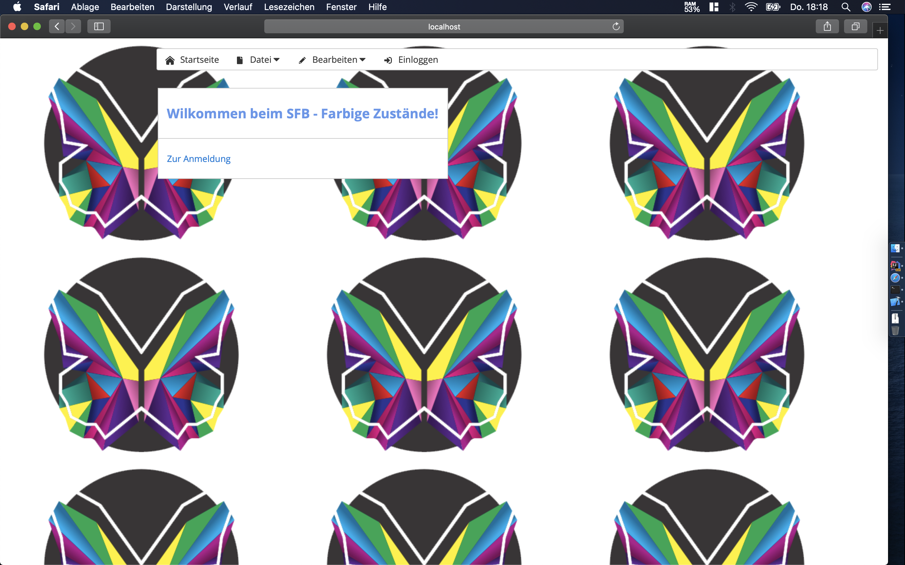
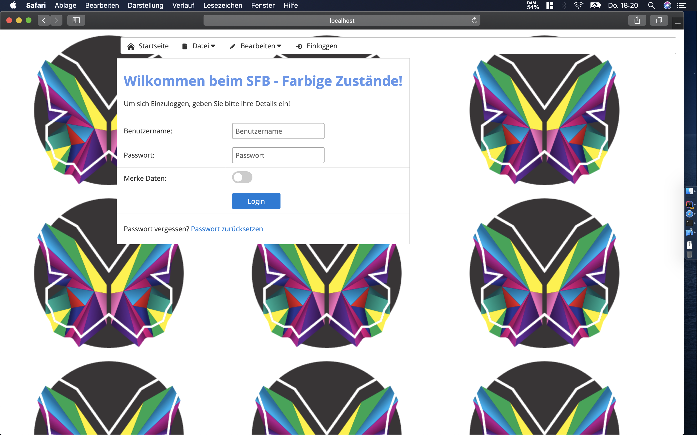
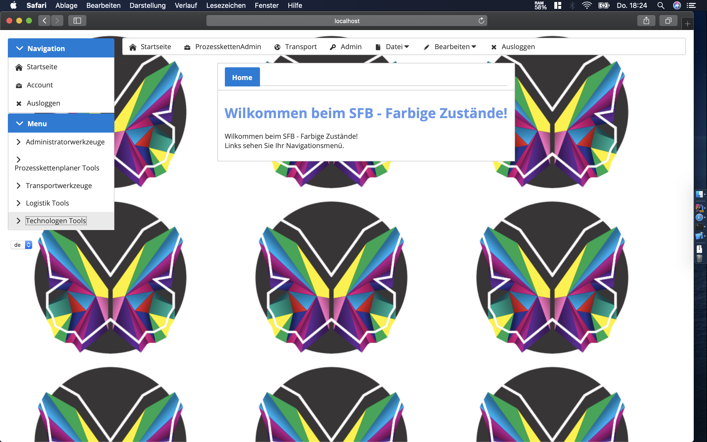
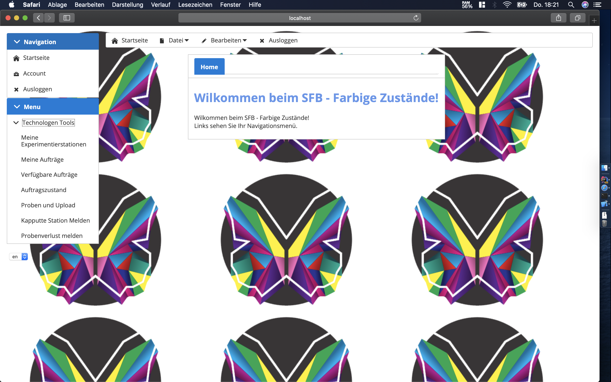

Tests
=====

Tests zur Generellen Funktion
-----------------------------

### Anwendungsfall: Login unterschiedlicher Nutzer

**Testvorbedingungen:** Sobald man die Webseite aufruft, wird man auf
die geleitet.\
{width="100%"} *Abbildung 3.1.1.1:
Startseite*

Hier kann man nun auf den Button *Zur Anmeldung* drücken, um zur
[Loginseite](#sc3.1.1.2) weitergeleitet zu werden. Ein valider Login ist
der Benutzername *admin* und das Passwort *12345678*.\
{width="100%"} *Abbildung 3.1.1.2:
Loginseite*

Jetzt haben wir uns als erstes mit einem falschen Passwort angemeldet,
was eine Fehlermeldung wirft, wie man auf dem nächsten
[Screenshot](#sc3.1.1.3) in der oberen Ecke sieht.\
{width="100%"} *Abbildung
3.1.1.3: Falsches Passwort für Admin eingegeben*

Anschließend wurde versucht, sich mit den validen Logindaten des Admins
einzuloggen und man kommt auf die [Startseite des Admins](#sc3.1.1.4).\
{width="100%"} *Abbildung 3.1.1.4:
Richtiges Passwort für Admin eingegeben*

Jetzt wurde sich noch versucht, mit den validen Logindaten für den
Technologen einzuloggen. Man wird auf die Startseite des Technologen
weitergeleitet.

{width="100%"} *Abbildung
3.1.1.5: Richtiges Passwort für Technologen eingegeben*

Wie man in den Beispielen sehen kann, kann man sich mit
unterschiedlichen Benutzern einloggen, welche unterschiedliche den
Rollen entsprechende Features haben. Man muss das richtige Passwort für
den Benutzernamen eingeben, um sich einloggen zu können. Die Tests
verliefen erfolgreich.\
Es muss noch mit falschem Benutzernamen getestet werden!

### Anwendungsfall: Beispiel 2

### Anwendungsfall: Beispiel 3

### Anwendungsfall: Beispiel 4

### Anwendungsfall: Beispiel 5

Automatisierte Funktionstests
-----------------------------

### Anwendungsfall: Beispiel 1

### Anwendungsfall: Beispiel 2

### Anwendungsfall: Beispiel 3

### Anwendungsfall: Beispiel 4

### Anwendungsfall: Beispiel 5
